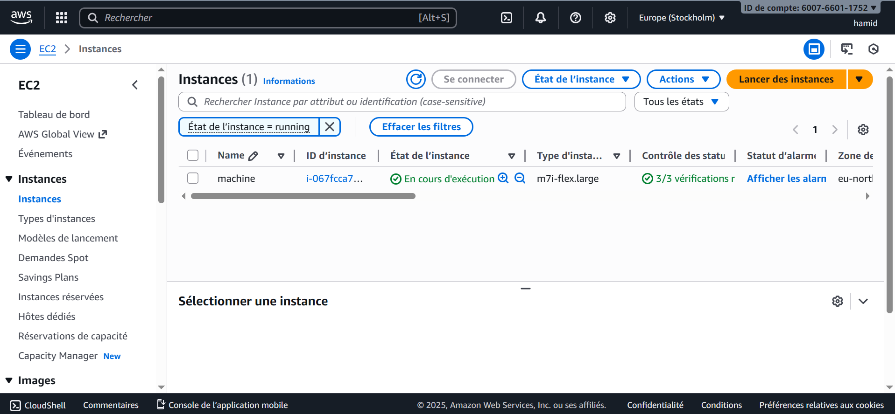
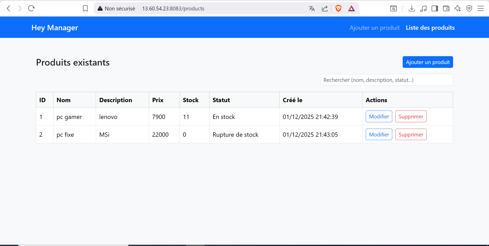
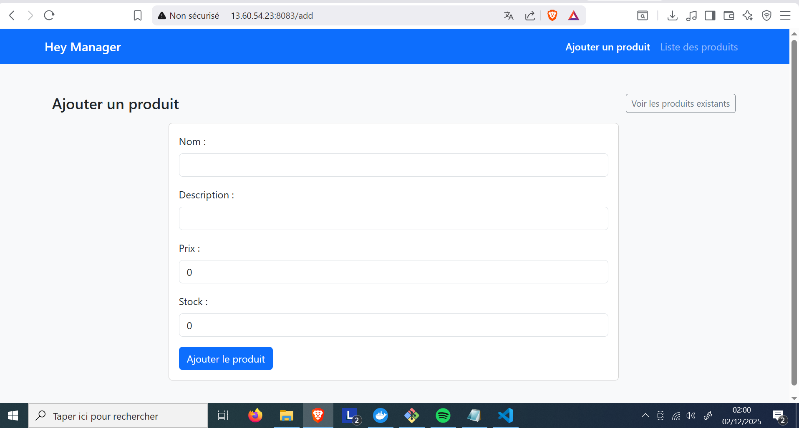
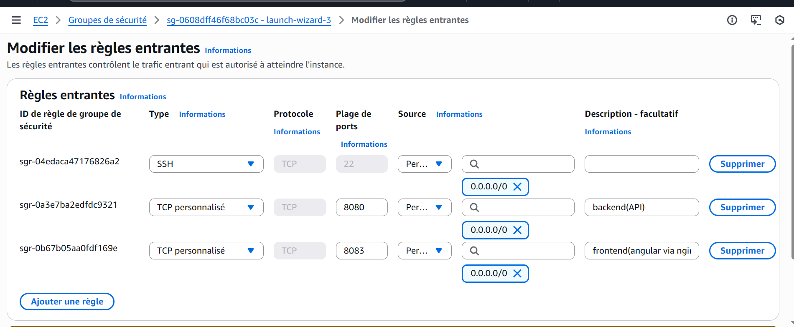

# Project Screenshots

## EC2 Dashboard
---

  

## Public IP Used for Deployment
---

  

## Running Containers via SSH
---

  

## Jenkins CI Pipeline
---

  

## Products List UI
---

  

## Add Product UI
---

  

## Security Group Rules
---

  

